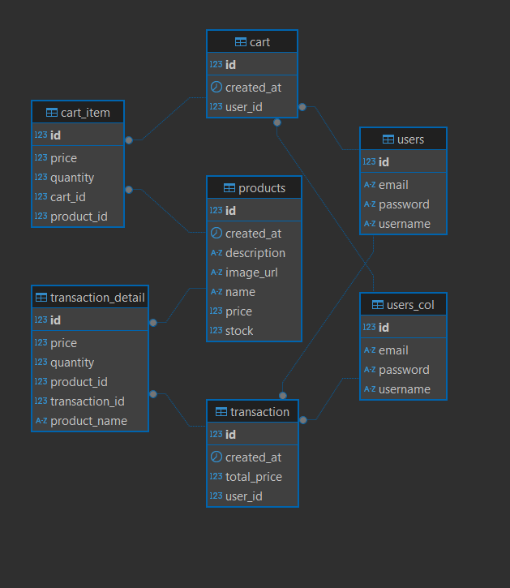

Merancang sebuah aplikasi e-commerce, saya memilih Monolithic Architecture karena kesederhanaannya pada manajemen dan pengembangan prostitutahapawal. Metode ini mengatur logika bisnis dan akses data di suatu aplikasi, dan sangat memudahkan pemeliharaan dan pengujian aplikasi. Secara khusus, mencakup table users, cart, cartItem, Product, Transaksi, dan TransactionDetail. Ada hubungan antar tabel yang jelas, yang sangat membantu keorganisasian informasi tentang pengguna, produk, belanja, dan transaksi. Sejak aplikasi ini tergolong sederhana dan membutuhkan kecepatan dalam pengembangan serta kemudahan dalam pemeliharaan, monolitik adalah pilihan tepat. Memiliki solusi sederhana dan operasional pada pengembangan, dan mungkin untuk mengembangkan aplikasi sebagai microservices di masa mendatang.